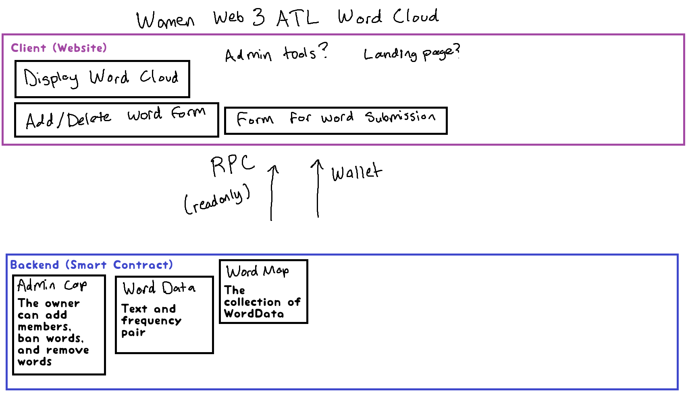
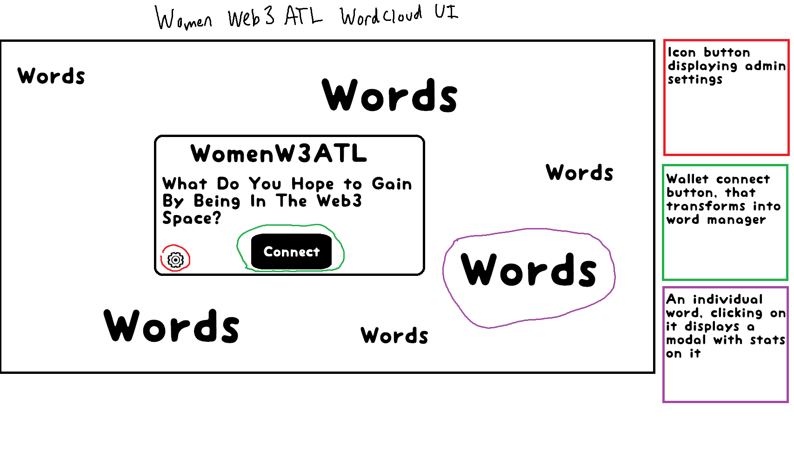

# Women in Web3 ATL Wordcloud Workshop

During this workshop we will learn how to create a full stack application on Sui from scratch using AI tooling. We will work collaboratively to build a word cloud answering the prompt of 
> What do you hope to gain by being in the web3 space?


## What's our goal?

We want to visually represent the voices of women
as text data where the importance of each word is shown with font size or color. The more frequently a word appears in the source text, the larger and more prominent it appears in the wordcloud. This makes it easy to identify the most common themes or topics at a glance. This should be built on Sui testnet

We will build this in about 8 key steps which I will outline here, that can be used when building most small scale software MVPs. I will include some key prompts that you can use to have AI tooling assist you

1. Scope
2. Backend, vs frontend, vs connections
3. Installation and setup instructions
4. Build the backend
5. Build the frontend
6. Build the connections
7. Upload to GitHub
8. DNS

## Feature

>I am wanting to vibe code a [description of the project]. What would be a appropriate features for an MVP? Just make a list

- Each woman should get to contribute up to 10 words with a 20 character limit
    - The visualization doesn't really look great with sentences so we should focus on broad concepts like "knowledge", "power", "independence", "self-custody"
- We need some place to store this obviously
- If multiple people choose the same word, it should be displayed larger. Therefore, we need to match every word submitted with the number of times it's been submitted (frequency).
- It might be worth it to ensure we store who wrote what words, and add functionality so that it can be changed later to maintain an up to date record of our community
- We might want to add functionality so that when new women join our group, they also are able to add 10 words. 
- We might want to have an admin at least in the beginning. Women should be invited by the admin to the wordcloud. Certain words should be banned or removed by the admin. As time goes on, we might do additional features to where this would be collectively decided through some voting mechanisms. Therefore, it may make since that this admin is changeable
- We want to display this wordcloud as a website. Perhaps we use this as a visualization as a landing page for this community

## Scope
> I have this feature list [features], how would I divide this functionality up (backend, client, etc)? Please make a simple table

It's important to have some idea of what goes where before you start working. Basically, you need the right tool for the job so certain features **must** be built on certain parts of our stack. A hammer will never replace a saw right?

A client is anything that the user interacts with directly with, which is the website in this case. It is responsible for displaying the wordcloud and visually guiding the user with forms to add/delete/modify the words. Without somewhere to store the words and such though, the website is just a pretty face. When you refresh the page, the words would be gone

The smart contract is the data layer. This stores the words and enforces the rules we decided on (like everyone only gets 10 words). Without a UI though, we just have a list of words and frequencies, which is boring to look at.

The RPC is the connection between the website and the smart contract. It allows you to view and send data from the Sui blockchain. For context, your wallet has an RPC inside it and that's how you create and broadcast transactions. When you connect your wallet on a website that is giving the website  RPC access. This project will effectively use two connections. We want people to view the word cloud **even if their wallet is not connected**, so we will want a direct RPC link in our project. We also want to allow users to connect their wallet though so they can submit words to the smart contract.


| **Feature**                               | **Client (Frontend)**                                  | **Smart Contract (Sui)**                      |
| ----------------------------------------- | ------------------------------------------------------ | --------------------------------------------- |
| Word input (10 words, 20-character limit) | UI form with input validation                          | –                                             |
| Display wordcloud (size by frequency)     | Render word cloud with frequency-based sizing          | Fetch word frequency and list                 |
| Store each word + user ID                 | –                                                      | Store words and associate with wallet address |
| Count word frequency                      | –                                                      | Maintain word frequency                       |
| Track who submitted which words           | –                                                      | Map words to contributor                      |
| Allow edits by original contributor       | UI for editing user's own words                        | Permissioned editing by original submitter    |
| Add new members to contribute             | –                                                      | Admin-only function to add members            |
| Admin invites new women                   | Admin UI for invitations                               | Admin-only invitation control                 |
| Ban/remove inappropriate words            | Admin interface to manage/delete words                 | Admin-only word removal                       |
| Admin can be changed                      | –                                                      | Admin address change function                 |
| Display site as a community landing page  | Landing page with embedded word cloud + connect wallet | Pull and display all data from contract       |



## Some setup stuff
You have to have a proper dev env before you start coding. I won't cover this, since it's pretty straightforward and depends on what operating system your pc is running (I am using linux). 
### Let's install node and react. 

### Let's install sui cli tool

### Let's set up a wallet with some sui

## Let's build the smart contract

> I have this scope: [scope] and these features: [features]. Please write the smart contract code with detailed comments, then generate a test file

When vibe coding smart contracts, you want to make sure the AI generates code **and tests**. All tests do is run the code and ensure that they do what they are designed to do. Assuming everything checks out, you already know that when you deploy the contract, it will work and you're not wasting money

## Let's build the UI
Draw a concept




### Start with a template
The hardest part of the UI build is probably gonna be the blockchain parts so lets start with a template that already has that working

> What templates exist for [react, vue, angular, etc] UI on Sui that support typescript and what are the pros and cons?

Always go with the typescript one if available. It's a much better choice when vibe coding to keep any AI hallucinations from getting out of hand

I ended up choosing Sui Kit with typescript and Vite

### Constants file and context


## Deployment

The application is automatically deployed to GitHub Pages when changes are pushed to the main branch. The deployment process:

1. Builds the frontend application
2. Deploys to GitHub Pages
3. Available at: https://womenw3atl.github.io/womenw3atl-wordcloud

### Building for Production

```bash
cd frontend
pnpm build
```

### Smart Contract Deployment

```bash
cd contracts
sui move build
sui client publish --gas-budget 100000000
``` 